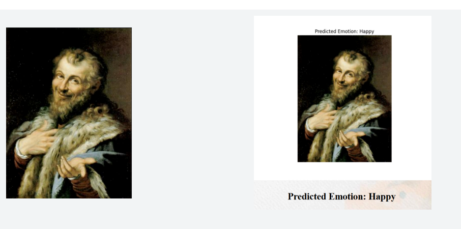

### Sample Output
Below is an example of a painting and the corresponding detected emotion:

# Emotion-Detection-of-paintings
Software Engineering Project Demonstration
Project Title:  Painting Emotion Categorization System
Introduction
This project aims to develop a system capable of categorizing emotions depicted in paintings. We utilize Convolutional Neural Networks (CNNs) for this task, leveraging two datasets from Kaggle: one comprising grayscale images of human faces displaying various emotions and another consisting of oil paintings of art portraits.

Datasets
Dataset 1: Emotion Detection (FER)
Link:  Emotion Detection (FER) Dataset
Description: This dataset contains 35,685 grayscale images of human faces exhibiting seven different expressions: happy, sad, neutral, angry, surprised, disgust, and fear.
Dataset 2: Art Portraits
Link:  Art Potraits Dataset
Description: Comprising approximately 4000 oil paintings of art portraits, this dataset serves as the testing ground for our model's ability to predict emotions in art.

Our Approach
We employ various features of the Keras library to preprocess the dataset containing human faces. This ensures uniformity in image formats and properties. Each image is labeled with the corresponding emotion.
The dataset is split into training, testing, and validation sets.
Training
We will  utilize the preprocessed Dataset 1 to train the CNN model. The model learns to recognize patterns and features associated with different emotions depicted in human faces.
Testing
The trained model will be then evaluated using Dataset 2, comprising art portraits. The goal is to predict the emotions depicted in these paintings and compare them with ground truth labels.

Conclusion
The project concludes with a discussion on the efficacy of the developed system, potential areas of improvement, and future work.

